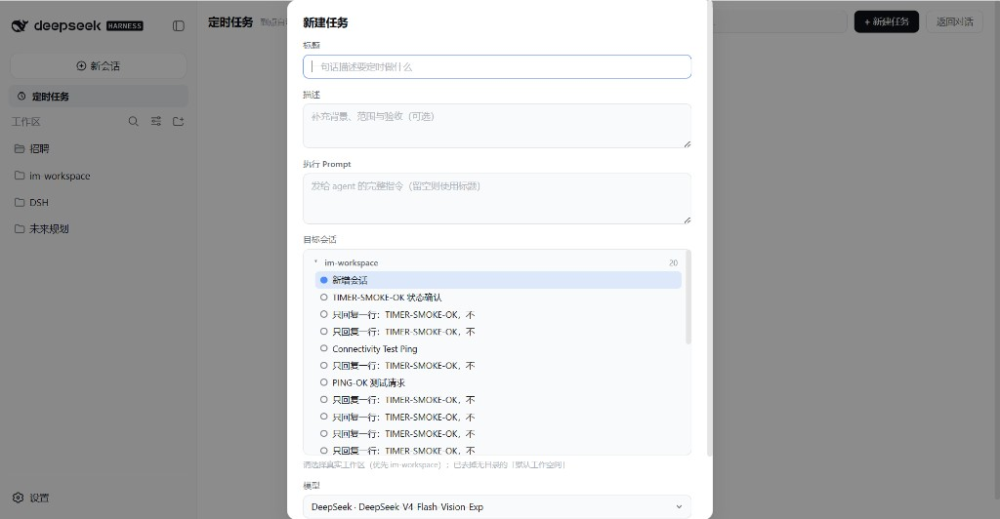

# dsh-timer-agent — DSH 定时任务插件

中文 | [English](./README.en.md)

个人维护的 [DeepSeek Harness (DSH)](https://deepseek-harness.github.io/deepseek-harness/) Web 插件：在 `dsh web` 宿主进程里跑常驻 cron，**到点用真实 agent 会话执行 prompt**。GUI 关掉也会继续触发。基于 [LouisHaoL/dsh-timer-agent](https://github.com/LouisHaoL/dsh-timer-agent) 改造，默认面向 IM 沙盒工作区（`im-workspace`）。

仓库：[onlyforchris/dsh-timer-agent](https://github.com/onlyforchris/dsh-timer-agent) · 当前版本：`@onlyforchris/dsh-timer-agent@0.1.3`



## 它做什么

到点（5 段 cron）通过**真实 agent 会话**执行你写好的 prompt：

- **指定已有会话** → 每次触发继续该对话（上下文连续）
- **指定项目 workdir** → 每次在该项目内新建会话（自动加载其 `AGENTS.md`）
- **优先选真实工作区**（如 `im-workspace`）新建会话；已去掉无目录的「默认工作空间」占位项

对话里可用 `timer_agent` 工具管理任务（create / list / update / pause / resume / remove / run）；侧边栏「定时任务」面板管理同一批任务——**一个台账，三个入口**（工具 / WebUI / 文件）。

## 架构

```
┌─ dsh web 宿主进程 ────────────────────────────────┐
│  60s ticker（常驻，GUI 关闭也运行）                │
│   ├─ HostJobStore   ~/.dsh/timer-agent/jobs.json  │
│   │                 （原子写，损坏降级不崩溃）      │
│   ├─ TimerRunner    at-most-once：先顺延 nextRunAt│
│   │                 再触发；运行中跳过；错过即跳过 │
│   │   ├─ agents.resume（钉住会话）                │
│   │   └─ agents.create + workspaceRegistry        │
│   │       （新会话挂到正确项目；默认可绑 IM 沙盒）│
│   ├─ timer_agent 工具（模型可调用）               │
│   └─ /api/dsh-timer-agent/* 路由（仅回环）        │
└────────────────────────┬──────────────────────────┘
                         │ HTTP 轮询镜像（5s）
┌─ 浏览器半边（薄）──────┴──────────────────────────┐
│  侧边栏入口 + 任务面板（React）                    │
│  工作区/会话目标树 · cron 预设 · 执行历史           │
└───────────────────────────────────────────────────┘
```

执行结算通过 `session/event`（`turn/end` 的 `reason.kind`）判定成功/失败，失败原因写入台账。

## 功能

- **定时执行**：5 段 cron（分 时 日 月 周，支持 `*` / `*/n` / `a-b` / 逗号列表）+ 预设下拉（每天 09:00 / 每小时 / 每 10 分钟 / 每周一 09:00）
- **目标树**：按工作区分组；每组含「新增会话」+ 已有会话；选中会话即钉住
- **任务面板**：列表、搜索、详情（cron 编辑 / 执行历史 / 查看会话 / 立即执行 / 重置 / 删除）
- **模型选择**：创建任务时可指定 provider/model，并带上部署默认的 `reasoningEffort`
- **模型工具**：任意对话中用 `timer_agent` 管理同一台账
- **系统提示注入**：host 注册 `plugin:timer-agent` 播报段
- **安全**：API 仅回环 + 同源

## 本 fork 相对上游的要点

- 默认 workdir 可指向 `D:\DSH\im-workspace`（IM 沙盒）
- 会话 ID **仅 ASCII**（中文任务名不再写入 session id，避免 DeepSeek 请求头 ByteString 报错被标成 `TRANSPORT`）
- 「查看会话」会先关闭定时面板再跳转 transcript
- 板面表单按宿主 UI 令牌收过样式（自定义下拉等）

## 安装

**方式 A · Release 包**

从 [Releases](https://github.com/onlyforchris/dsh-timer-agent/releases) 下载 `onlyforchris-dsh-timer-agent-*.tgz`：

```sh
dsh plugin --profile web add ./onlyforchris-dsh-timer-agent-0.1.3.tgz
```

发布到 npm 后，也可以安装固定版本：

```sh
dsh plugin --profile web add --save-exact @onlyforchris/dsh-timer-agent@0.1.3
```

**方式 B · 本地 link 开发**

```sh
pnpm install && pnpm run build
dsh plugin --profile web add link:<本目录绝对路径>
```

安装后用 **`DSH 管理.bat` 重启** `dsh web`；侧边栏出现「定时任务」即生效（浏览器侧改动强刷 `Ctrl+F5`）。

## 构建与测试

```sh
pnpm install
pnpm run build      # lib/index.js（host）+ lib/client.js（浏览器，CSS 已内联）
pnpm run typecheck
pnpm test           # 行为级 E2E（fake host，无需 dsh 运行时）
pnpm run smoke-test # 静态结构冒烟
```

E2E 覆盖：cron 解析与下次运行、台账原子写与损坏降级、at-most-once 触发、钉住会话 resume、`turn/end` 结算、运行中拒绝重复触发、禁用调度、手动触发、workdir / defaultWorkdir、中文标题 → ASCII session id、`timer_agent` 全动作、HTTP CRUD + 回环/同源防线。

## 已知限制

- 依赖 `dsh web` 进程存活；停服不触发；重启后只跑已顺延到期的任务，错过即跳过
- 运行中到点会跳过本次，等下一个 cron 点
- 消耗 API 额度；无人在场时 prompt 须自包含、不可提问
- 旧会话若 ID 含非 ASCII，打开后仍可能 `TRANSPORT`——请用新版本重新「立即执行」生成新会话

## License

[MIT](./LICENSE)
